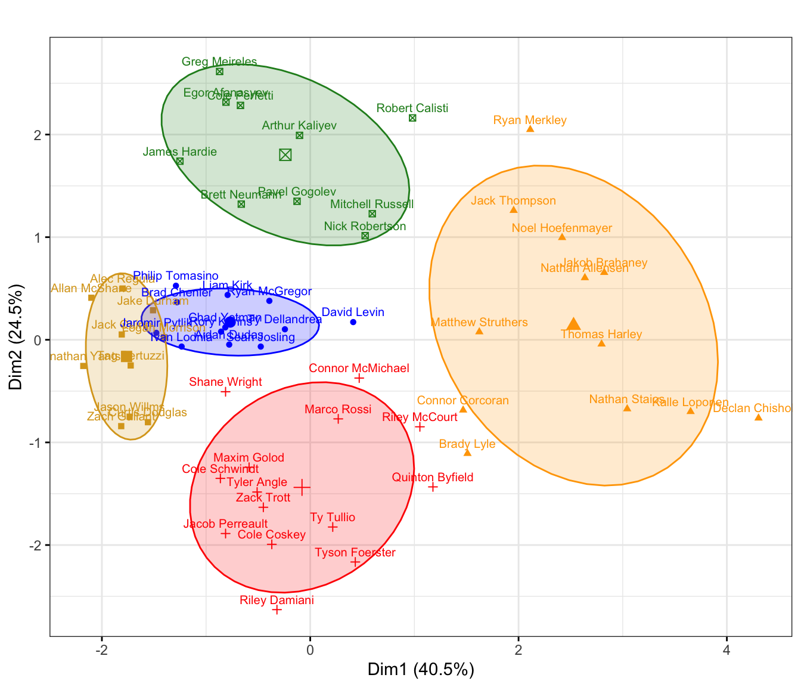

# Introduction

Since the NHL was formed in 1917, the OHL (formerly OHA before 1980) has consistently been one of the best pipelines for future NHL stars. However, many hockey fans don't have the ability or time to watch these prospects on a regular basis.

The purpose of this article is to use **fuzzy c-means clustering to group OHL players based on their power play shooting tendencies**. I hope to provide anyone who is interested in the OHL with an overview of where the league's top players are playing on the power play and create a framework for clustering players based off of PP shot location data that has not been done in the public domain so far (to my knowledge).

Clustering is a commonly-used machine learning algorithm that helps us find groups of similar objects (players, in this case) in data based on a given set of features (proportion of shots in each given region of the offensive zone, which I define in the next section). In terms of clustering shot data, previous work has been done on [clustering players based on shot type by a blogger by the name of Em](https://em-ee.netlify.app/post/nhl_clusters.html), [clustering players based on statistics to identify goal scorer styles by Alex Novet](https://hockey-graphs.com/2018/01/04/goal-scorer-cluster-analysis/), and [clustering players based on the mean xy-coordinates of their ES and PP shots by Jake Flancer](https://threepointgames.blogspot.com/2018/05/who-plays-where-determining-skater.html).

This article will cluster players by the xy-coordinates of their shots like Jake Flancer's work, but I will bin each player's shots into regions and calculate the proportion of shots in each region as opposed to taking the mean coordinates of all shots in the data processing stage. There are some clear limitations to this new approach, but it clusters power play shot data well and provides a good visualization of the results.

# Processing the Data

I performed this clustering on my cleaned up version of the 2019-20 OHL play-by-play data scraped and shared by [Dave MacPherson on Twitter](https://twitter.com/davemacp/status/1239306719253204994). The raw PBP data did not include the strength state of shots, so I wrote some code to classify each shot as power play, even strength, or short-handed. However, I should note that there is still likely a slight margin of error of roughly +/- 4 shots for each player.

After cleaning up the data, I filtered for all OHLers with **40 or more PP shots** leaving **58 players** to analyze. Next, I **binned each player's shots into six regions** as displayed below. These regions represent the five traditional positions in an umbrella power play (netfront, bumper, left and right flank, point) with the point broken up into left and right sides to identify which side the pointman tends to lean on when shooting.

You might have also noticed the grey perimeter around these six regions. I was originally planning on including these shots into my analysis to identify any players who are taking an abundance of clearly low-danger shots, but no player in the data set had more than 5 shots from this region so I decided to chalk them up as noise and leave it out of the cluster analysis.

**Binning the data is generally not preferred** since it can lead to some similar shots being categorized differently and some different shots being treated as the same, especially with the small number of large bins used in this project. For example, in the figure below, we would treat shots A and B as completely different since they are in different regions, while B and C will be treated as the same since they both lie in the Right Flank region.

With that said, **I believe binning is sufficient for clustering power play shot data due to the static nature of offensive teams on the PP and the consistency of the umbrella set up across nearly all levels of hockey**. In addition, many of these players have a small sample size of shots (ranging from 40-114 SOG), so the large bin size may somewhat reduce the accuracy but will make the data easier to cluster.

*(My next article will attempt to mitigate this binning issue and use a stronger clustering algorithm to solve this same problem with NHL even strength data. For now, this method works well on the OHL PP shot data and will provide a great visualization of the player shot tendencies, which I will display in the results section.)*

Once I binned the data, I took the proportion of the player's total shots in each region. Taking the shot proportions rather than shot counts helps the clustering algorithm group players who are generating shots from similar areas, even if they have much different shot totals. For example, Arthur Kaliyev has 53 shots from the right flank region, accounting for 46.5% of his shots, while Egor Afanasyev has 29 shots from the right flank, which is 40.3% of his shots. Since we are more concerned in determining *where* players are shooting from rather than how much each player is shooting, proportions will provide better results.

That concludes the data preparation I did to setup the data for clustering. The following table is the first 6 rows of the final data frame I used for clustering.

|               | bumper| leftpoint| leftwing| netfront| rightpoint| rightwing|
|:--------------|------:|---------:|--------:|--------:|----------:|---------:|
|Aidan Dudas    | 0.2439|    0.0000|   0.2927|   0.1707|     0.1220|    0.1707|
|Alec Regula    | 0.2609|    0.0290|   0.0435|   0.4783|     0.0435|    0.1159|
|Allan McShane  | 0.2439|    0.0000|   0.0732|   0.4878|     0.0000|    0.1463|
|Arthur Kaliyev | 0.1491|    0.0702|   0.1053|   0.1053|     0.0965|    0.4649|
|Brad Chenier   | 0.2128|    0.0638|   0.1064|   0.4043|     0.0426|    0.1702|
|Brady Lyle     | 0.1389|    0.2361|   0.3056|   0.0694|     0.2083|    0.0278|

# Fuzzy c-Means Clustering

As some of my Twitter followers may have seen, I also [attempted to solve this same problem using Ward's method hierarchical clustering](https://twitter.com/BrendanKumagai/status/1282458988567764996) in the past. However, I opted to change to [fuzzy c-means clustering (FCM)](https://www.datanovia.com/en/lessons/fuzzy-clustering-essentials/fuzzy-c-means-clustering-algorithm/) for this writeup because the flexible nature of its results is better-suited for the type of data I have. 

Fuzzy c-means is a "fuzzy" clustering algorithm, meaning that **players are not strictly assigned to one cluster, but instead they are given a "degree" (between 0 and 1) to which they belong to each cluster**. This feature is especially helpful when it comes to players that spent time at different spots on the power play over the season, whether that is caused by a trade or a coach trying to shake things up. For example, 2020 top prospect Quinton Byfield's PP shot chart below shows us that he has spent time this season both at the netfront and the left flank/left point. A method like hierarchical clustering will strictly define a player into one cluster, while fuzzy c-means allows Byfield to be in several different clusters to varying degrees.

## Fuzzy c-Means Algorithm

Here is a simple overview of the steps that go into the fuzzy c-means algorithm:

1. Specify the number of clusters (5 clusters in hopes of finding 1 cluster for each PP position).

2. Randomly select 5 "cluster centres" (5 data points that are considered the average proportion of shots in each of the 6 regions for the players assigned to said cluster).

3. For each player, calculate the degree to which he belongs to each cluster.

4. Determine the "fuzzy" cluster centres that minimize the total weighted distance between each player and the cluster centres, where the weights are the degree to which a player belongs in the cluster.

5. Repeat 3 and 4 until you minimize the total weighted distance between each player and the fuzzy cluster centres.

If you were interested in learning more, I found [this page](https://sites.google.com/site/dataclusteringalgorithms/fuzzy-c-means-clustering-algorithm) helpful for understanding the math behind the FCM algorithm.

# Clustering Results

The results of the FCM clustering are visualized below in a bubble heatmap. The background colour represents the 5 different clusters and the "bubbles" represent the proportion of shots in a given region for each player. It looks like the FCM algorithm does a pretty good job separating the five different PP positions.

Building off of this, I also plotted out the degree to which each player belongs to his designated cluster below. Players with low values (i.e. Byfield, Merkley, etc.) are not as tightly associated with their cluster and are more likely to have a high proportion of shots from multiple regions. On the other hand, players with high values (i.e. Wilms, Harley, etc.) have a very strong degree of association to their cluster and tend to have shots more focused in one region of the ice.

On top of that, I also visualized this data in 2D using Principal Component Analysis. This seems to reinforce the results of the degree of cluster membership plot above, with most players that have a low degree of cluster membership being on the fringes of their given cluster (i.e. Byfield, Merkley, Lyle, Levin, etc.).

There is also some overlap between the netfront (gold) and bumper (blue) clusters, which makes sense since bumper players tend to generate a good chunk of their shots from rebounds and scramble plays.

From a statistical perspective, it is also interesting to see that reducing the six-dimensional data matrix back to two dimensions generates a nearly exact image of where we would see on a 2D rink if we were to place each player based on their shot maps. The bumper (blue) is right behind the netfront (gold), the left (red) and right (green) flanks are to the left and right of the bumper (when facing the net), and the point (orange) is behind all of the other areas.

Now that we have an overview of the results, lets dig a little deeper into each of the five clusters.

## Cluster 1: Concentrated Netfront

The first cluster represents players that generate a very high proportion of their PP shots from the netfront as shown in the shot map below. They have the highest shooting percentage of all clusters with 18.89%, which may lead to a bit of inflation in their goal totals. 

Interesting Observation: Alec Regula, the 6'4" London Knights' defenceman, is an odd player to find at the netfront. With Adam Boqvist/Evan Bouchard (18-19) and Merkley (19-20) already being excellent PP quarterbacks, the Knights decided to slide their big defenceman down low where he thrived in the netfront and bumper positions leading all defencemen with 15 PPG this season. However, this is something to consider when looking at his stats to project his offensive upside, 26 of his 60 points this season came on the PP and there is no guarantee that he will get PP time up front at the next level.

